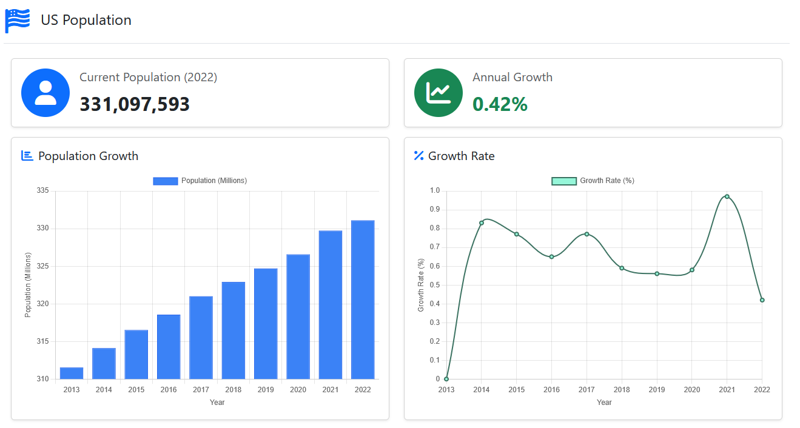

<h1 style="line-height: 90%;">Topics in CS: Assignment 2 </h1>
<h3 style="line-height: 10%;"> Spring 2025 </h3>

<h1 style="line-height: 100%;">US Population</h1> 

[main.py](main.py)

<h3 style="line-height: 100%;">This assignment was built with a FastAPI backend serving a Jinja template customized with Bootstrap, easy is as easy does.</h3>

<h1 style="line-height: 100%;">Preview</h1>

